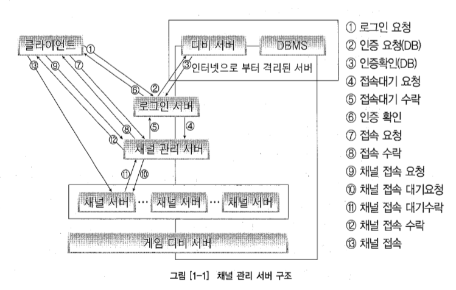
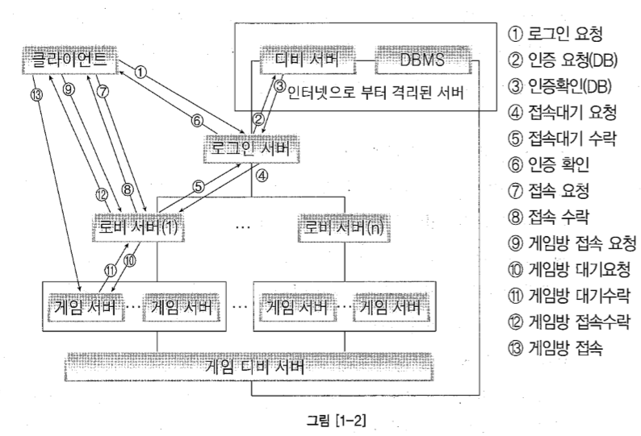
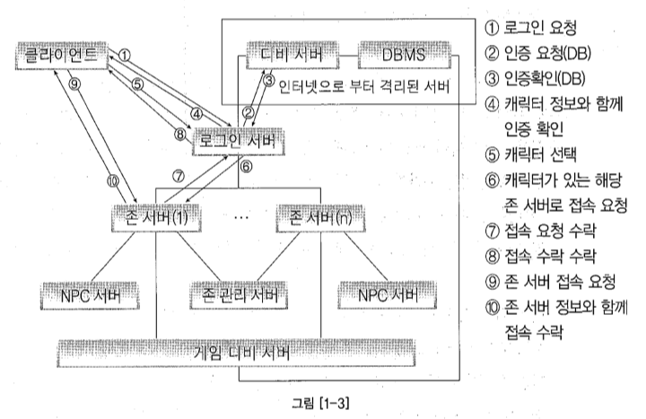
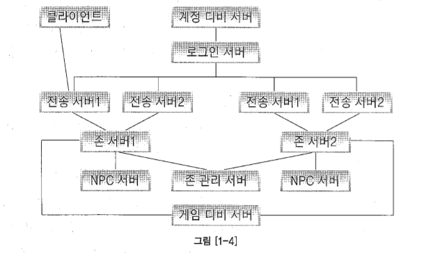

## Ch01 - 온라인 게임 서버 시작편

*****

#### 어떤 게임 서버를 만들 것인가?
> ## 1. 채널형 게임 서버 구조
>> * 고스톱, 테트리스와 같은 머드게임에서의 게임 서버로 채널을 나누고 채널 내에서 방을 개설, 방 내에서 플레이를 하는 형식

>> 
>>> * DBMS 서버는 내부 네트워크에만 연결
>>> * 로그인 서버는 DBMS에서 계정 유효성을 확인하고, 채널 관리 서버로 해당 클라이언트를 관리하도록 인계한다.
>>> * 단일 게임 구조에서는, 로그인 서버와 채널 관리 서버가 같이 묶일 수 있음
>>> * 채널 관리 서버는 모든 아이피와 포트 및 채널 서버에 접속하는 사용자의 수와 최대 접속자 수를 관리한다. 
>>> * 대부분의 처리는 채널 서버에서, 게임 진행 후 게임 디비 서버와 연결하여 저장

*****

>> 위 구조에서의 특징은 다음과 같다. 
>> * 단일 게임 서버(채널)가 아니므로 관리에 용이하며 추후 서버가 확장되더라도 새로운 서버를 채널 관리 서버에 연결해주면 된다.
>> * 채널 인원의 최대최소를 처리하지만, 적절히 분산하여 배치하지는 못한다.

>> 다음은 위 구조에서 확장된 채널 관리 서버의 구조이다. 

>> 
>>> * 게임 접속 후 게임 채널을 선택하여 접속할 때, 게임 서버는 다르더라도 로비 서버는 같을 수 있다. 
    즉, 로비 서버에서 게임 서버를 논리적으로 나눈 개념이다.
>>> * 로비 서버는 논리적으로 나눈 게임 서버에 유저를 연결해주며, 이 때 Load Balancing을 통해 적절히 부하분산하여 처리한다.

*****

> ##2. MMO형 게임 서버 구조
>> * Zone 개념으로 사용자를 구분, 영역 내에서 많은 수의 유저들이 같이 플레이하는 형식
>> 
>>> * 가장 간단한 서버 구조로, 디버깅 및 관리에 용이
>>> * 모든 존 서버의 부하가 동일하지 않은 문제점 존재

>> 필자는 다음 그림과 같이 로드 밸런싱을 처리할 수 있는 서버를 두는 방식을 소개한다. 
>> 이와 같이, Zone 개념의 게임 서버는 기본적인 구조이며, 효율과 요구사항에 의해 게임 서버의 구조는 다양하게
    변화할 수 있음을 이야기하고 있다.

>> 
>>> * 접속한 유저는 로드 밸런싱을 통해 적절한 전송 서버에 연결되며, 전송 서버가 유저를 존 서버로 연결시킨다.
>>> * 전송 서버 - 존 서버 간의 통신 오버헤드가 발생할 수 있다.

