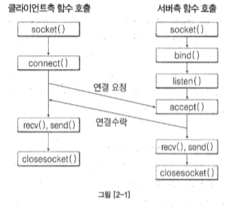
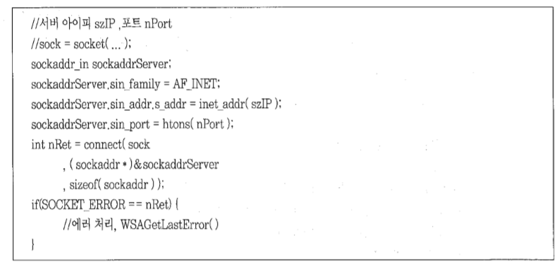
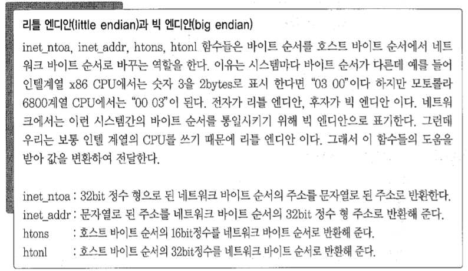
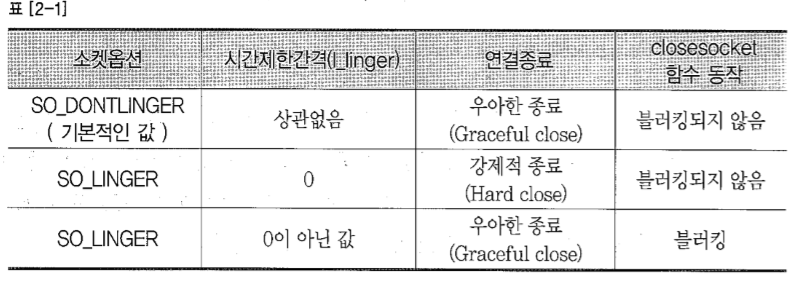

## Ch02 - 온라인 게임 서버 기초

*****

#### 온라인 게임서버를 만드는데 필요한 기초적인 지식들을 학습한다.


> ### 2.1 소켓
>> 내부/외부 프로세스 간 통신을 위해 응용프로그램 수준으로 만들어진 통신 진입점

>>> 스트림 소켓(TCP)와 데이터 그램(UDP) 소켓으로 구분된다.
>>>> 연결 지향(TCP)과 비연결성(UDP)를 설명하자면<br>
>>>>* TCP는 연결이 정립(established)된 뒤 통신한다. 패킷들의 순서를 확인하고, 조립하며, 오류를 처리하고 필요시 재전송 되는 신뢰성있는 통신 방법이다.<br>
>>>>* UDP는 연결되지 않은채 통신한다. 패킷을 데이터그램 단위로 전송하며 순서를 구분할 수 없고, 데이터의 경계가 존재한다.

>>> 동작 방식에 따라 Blocking 모드와 Non-Blocking 모드르 작동한다.
>>>> * Blocking 모드는 해당 통신함수의 요청의 완료와 실제 요청의 처리 시간이 같은 방식이다. 예를 들어 전송을 요청(Send)하면, Send 함수는
    보내려는 내용이 전송버퍼에 담기기 까지 반환하지 않고 대기한다.  
>>>> * Non-Blocking 모드는 통신 함수를 호출한 뒤 해당 함수는 바로 반환되어 다른 작업이 가능하다. 함수의 반환과 요청의 처리가 동일하지 않으므로
    요청이 진행되었는지 따로 확인해야 한다. 


>> ####연결지향형 통신(TCP/IP)
>>> 

>> 다음은 사용하는 소켓 함수들을 나열한다.
    
>>>> ```int sockfd = socket(int domain, int type, int protocol)```
>>>> * sockfd: socket descriptor, an integer (like a file-handle), if errors, INVALID_SOCKET
>>>> * domain: integer, communication domain e.g., AF_INET (IPv4 protocol) , AF_INET6 (IPv6 protocol)
>>>> * type: communication type
>>>> * SOCK_STREAM: TCP(reliable, connection oriented)
>>>> * SOCK_DGRAM: UDP(unreliable, connectionless)
>>>> * protocol: Protocol value for Internet Protocol(IP), which is 0. This is the same number which appears on protocol field in the IP header of a packet.(man protocols for more details)

>>>> TCP 소켓의 예시 - socket(AF_INET, SOCK_STREAM, IPPROTO_TCP); <br>
>>>> UDP 소켓의 예시 - socket(AF_INET, SOCK_DGRAM, IPPROTO_UDP); <br>

*****

>>>> ```int connect(int sockfd, const struct sockaddr *addr, socklen_t addrlen);```
>>>> * sockfd: 생성한 소켓의 fd
>>>> * addr: 연결하고자 하는 서버의 주소가 담긴 구조체 포인터
>>>> * addrlen: addr 구조체의 크기, 주소 방식에 따라 구조체의 크기가 다르므로, 이를 통해 명시해야 한다.
>>>> <br>

>> 다음은 네트워크 통신을 위해 지원하는 엔디안과 아이피 주소 관련 함수에 대한 설명이다.
>>>> <br>

>>>> ```int bind(int sockfd, const struct sockaddr *addr, socklen_t addrlen);```
>>>> * sockfd: 생성한 소켓 fd
>>>> * addr: 해당 소켓과 호스트를 연결시키기 위한 주소
>>>> * addrlen: addr 구조체의 크기<br>
>>>> 특별한 목적이 아니라면, 서버는 다양한 주소를 가진 클라이언트의 접속을 수용하므로, 다음과 같이 설정하여 처리한다.
>>>>```angular2html
>>>>    sockaddr_in sa;
>>>>    sa.sin_family = AF_INET;
>>>>    sa.sin_addr.s_addr = htonl(INADDR_ANY); //INADDR_ANY를 통해 모든 클라이언트의 접속을 수용
>>>>    sa.sin_port(portNumber);
>>>>    if (0 != bind(sock, (sockaddr*)&sa, sizeof(sa)) {
>>>>        //error...
>>>>    }
>>>>```

>>>> ```int listen(int sockfd, int backlog);```
>>>> * sockfd: 클라이언트 접속을 수용(accept)할 서버 소켓 fd
>>>> * backlog: 한 accept 처리 중 다른 connect 요청이 오면, 이 숫자 만큼 대기열 큐를 할당하여 대기시킨다.

>>>>> 추가 : backlog는 동시에 처리할 수 있는 connect의 개수로 알고 있다. 좀 더 상세히 얘기하면
      	현재 소켓이 다른 작업(혹은 이미 accept)으로 바로 accept를 진행하지 못할때, connect 하는 요청자를 큐에 두어 처리하는 방법이며, backlog는 그 크기이다.
      	하지만, backlog가 0 이더라도 작동은 잘 진행된다. <br>
      	backlog의 값은 사실 큐의 크기를 결정하는 것이 아닌, 큐의 크기에 대한 힌트를 제공하는 것이다. 실제 내가 주는 값으로 크기가 결정되지 않는다.
      	SOMAXCONN, SOMAXCONN_HINT(N) <br>
      	[참조1] : 	https://msdn.microsoft.com/en-us/library/windows/desktop/ms739168(v=vs.85).aspx 
      	
 
 >>>> ```int new_socket= accept(int sockfd, struct sockaddr *addr, socklen_t *addrlen);```
 >>>> * new_socket: accept의 결과로 생성된 서버-클라이언트간 통신 소켓, 오류시 INVALID_SOCKET
 >>>> * addr: 새로이 연결된 클라이언트의 주소 정보
 >>>> * addrlen: 주소 정보의 크기이나, output parameter가 아님을 주의한다. addr의 사이즈를 명시해야 한다.
 

>>> <br><br>**데이터 송수신 함수**
>>>> ```angular2html
>>>> int recv(
>>>>   SOCKET                          s,
>>>>   __out_data_source(NETWORK) char *buf,
>>>>   int                             len,
>>>>   int                             flags
>>>> );
>>>>```
>>>> * s: 수신하고자 하는 대상과 연결되어있는 소켓
>>>> * buf: 데이터를 저장할 공간
>>>> * len: buf의 크기
>>>> * flags: 특별한 경우가 아니면 0을 넣는다. 좀 더 자세한 사항은  [참조2] : https://docs.microsoft.com/en-us/windows/desktop/api/winsock/nf-winsock-recv
>>>> <br><br> 반환 값은 수신된 데이터 크기이며, 0은 통신 종료, SOCKET_ERROR가 발생할 수 있다. 
>>>> <br> 소켓이 Non-Blocking이었다면 WSAWOULDBLOCK인지 확인해야 한다.

>>>> ```angular2html
>>>>    int WSAAPI send(
>>>>      SOCKET     s,
>>>>      const char *buf,
>>>>      int        len,
>>>>      int        flags
>>>>    );
>>>> ```
>>>> * s: 전송하고자 하는 대상과 연결되어있는 소켓
>>>> * buf: 보낼 데이터가 저장된 버퍼
>>>> * len: 보낼 크기
>>>> * flags: 특별한 경우가 아니라면 0을 넣는다. [참조3] : https://docs.microsoft.com/en-us/windows/desktop/api/winsock2/nf-winsock2-send
>>>> <br><br> 반환 처리는 recv()와 동일하다.


>>> <br><br>**연결 종료 함수**
>>>> ```int shutdown(SOCKET s, int how);```
>>>> * how: SD_RECEIVE, SD_SEND, SD_BOTH 이 소켓이 어떠한 작업을 그만 둘 지 표현한다.
>>>> <br><br> 우아한 종료의 예시인 half-close 방식은 다음과 같이 처리된다.

>>>>> <br> 종료할 생각이므로 SD_SEND만을 진행하여 상대방에게 종료할 것이라 전송한다(EOF). 이후 상대방도 그에 대한 처리를 진행하고 종료해도 좋다고 보내줄 것이기에, SD_RECEIVE는 남겨 두고, 이후 상대방도 종료하겠다는 응답(recv result == 0)이 오면 closesocket()을 진행하는 방식이다.

>>>> ```int closesocket(SOCKET s);```
>>>> <br> 소켓 연결을 종료하고 소켓 리소스를 반환한다. 만일 소켓에 비동기 Overlapped 작업이 남아있더라도 모두 취소된다.
>>>> <br><br> 소켓 옵션을 통해 종료시에 처리방법에 대해 제어할 수 있다.
>>>> <br>
>>>> SO_LINGER와 SO_DONTLINGER의 동작 차이
>>>>> default는 DONTLINGER이며 보낼데이터가 남아있으면 보낼때까지 연결을 끊지 않지만 closesocket시에는 종료한다.<br>
     LINGER에서 linger값이 0이면, 강제적 종료로 남아있어도 바로 종료한다.<br>
     LINGER에서 linger값이 0 이상이면 그 값은 타임아웃으로 처리된다. 이 때만, closesocket이 blocking되고 시간내 처리 못했다면 SOCKET_ERROR 반환
     	


>> ####비연결지향형 통신(UDP/IP)
>>>> ```angular2html
>>>> int recvfrom(
>>>>   SOCKET                          s,
>>>>   __out_data_source(NETWORK) char *buf,
>>>>   int                             len,
>>>>   int                             flags,
>>>>   sockaddr                        *from,
>>>>   int                             *fromlen
>>>> );
>>>> ```
>>>> 비연결성 통신이므로, 수신받고자 하는 대상을 from과 fromlen에 설정하여 수신하게 된다.

>>>> ```angular2html
>>>> int sendto(
>>>>   SOCKET         s,
>>>>   const char     *buf,
>>>>   int            len,
>>>>   int            flags,
>>>>   const sockaddr *to,
>>>>   int            tolen
>>>> );
>>>> ```
>>>> sendto 역시 동일하게 처리된다.

>>> <br><br>**그 외 함수들**
>>>> ```int getsockname(SOCKET s, struct sockaddr FAR* name, int FAR* namelen);```
>>>> 해당 소켓에 설정되어있는 로컬 주소 정보를 얻어온다.

>>>> ```int getpeername(s, name, namelen);```
>>>> 로컬 주소가 아닌 상대방 주소 정보를 얻어온다. 연결지향형 통신에서 사용되겠다.

>>>>```angular2html
>>>>int setsockopt(
>>>>  SOCKET     s,
>>>>  int        level,
>>>>  int        optname,
>>>>  const char *optval,
>>>>  int        optlen
>>>>);
>>>>```
>>>> 소켓의 옵션을 설정할 수 있다. 이전에 설명한 closesocket 시의 종료 처리 관련 설정이나, 내부적으로 사용하는 수신버퍼와 송신버퍼의 크기 설정 등이 가능하다.
>>>> <br> 좀 더 자세한 사항은 [참조3] : https://docs.microsoft.com/en-us/windows/desktop/api/winsock/nf-winsock-setsockopt

>>>> ```int getsockopt(s, level, optname, optval, optlen);```
>>>> <br>소켓에 설정된 옵션 정보들을 얻을 수 있다.

>>>> ```int ioctlsocket(SOCKET s, long cmd, u_long* argp);```
>>>> <br>소켓의 입출력 모드를 제어한다. 이를 통해 소켓을 Non-Blocking하게 만들 수도 있다. 자세한 사항은 [참조4] : https://docs.microsoft.com/en-us/windows/desktop/api/winsock/nf-winsock-ioctlsocket
>>>> <br>다음은 소켓을 Non-Blocking으로 만드는 예시이다.
>>>> ```angular2html
>>>> unsigned long lNonBlocking = 1;
>>>> int nRet = ioctlsocket(sock, FIONBIO, &lNonBlocking);
>>>> if(SOCKET_ERROR == nRot) ...
>>>> ```
