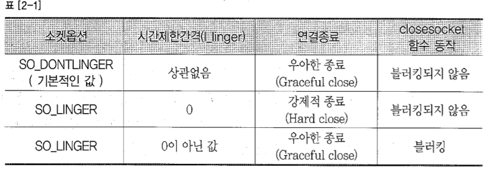

## Ch02 - 온라인 게임 서버 기초

*****

#### 온라인 게임서버를 만드는데 필요한 기초적인 지식들을 학습한다.
#### 내용이 많아 이론편과 윈도우즈IO모델 두 편으로 나눈다.


> ### 2.1 2.2 소켓 및 WinSock
>> 내부/외부 프로세스 간 통신을 위해 응용프로그램 수준으로 만들어진 통신 진입점

>>> 스트림 소켓(TCP)와 데이터 그램(UDP) 소켓으로 구분된다.
>>>> 연결 지향(TCP)과 비연결성(UDP)를 설명하자면<br>
>>>>* TCP는 연결이 정립(established)된 뒤 통신한다. 패킷들의 순서를 확인하고, 조립하며, 오류를 처리하고 필요시 재전송 되는 신뢰성있는 통신 방법이다.<br>
>>>>* UDP는 연결되지 않은채 통신한다. 패킷을 데이터그램 단위로 전송하며 순서를 구분할 수 없고, 데이터의 경계가 존재한다.

>>> 동작 방식에 따라 Blocking 모드와 Non-Blocking 모드르 작동한다.
>>>> * Blocking 모드는 해당 통신함수의 요청의 완료와 실제 요청의 처리 시간이 같은 방식이다. 예를 들어 전송을 요청(Send)하면, Send 함수는
    보내려는 내용이 전송버퍼에 담기기 까지 반환하지 않고 대기한다.  
>>>> * Non-Blocking 모드는 통신 함수를 호출한 뒤 해당 함수는 바로 반환되어 다른 작업이 가능하다. 함수의 반환과 요청의 처리가 동일하지 않으므로
    요청이 진행되었는지 따로 확인해야 한다. 


>> ####연결지향형 통신(TCP/IP)
>>> 

>> 다음은 사용하는 소켓 함수들을 나열한다.
    
>>>> ```int sockfd = socket(int domain, int type, int protocol)```
>>>> * sockfd: socket descriptor, an integer (like a file-handle), if errors, INVALID_SOCKET
>>>> * domain: integer, communication domain e.g., AF_INET (IPv4 protocol) , AF_INET6 (IPv6 protocol)
>>>> * type: communication type
>>>> * SOCK_STREAM: TCP(reliable, connection oriented)
>>>> * SOCK_DGRAM: UDP(unreliable, connectionless)
>>>> * protocol: Protocol value for Internet Protocol(IP), which is 0. This is the same number which appears on protocol field in the IP header of a packet.(man protocols for more details)

>>>> TCP 소켓의 예시 - socket(AF_INET, SOCK_STREAM, IPPROTO_TCP); <br>
>>>> UDP 소켓의 예시 - socket(AF_INET, SOCK_DGRAM, IPPROTO_UDP); <br>

*****

>>>> ```int connect(int sockfd, const struct sockaddr *addr, socklen_t addrlen);```
>>>> * sockfd: 생성한 소켓의 fd
>>>> * addr: 연결하고자 하는 서버의 주소가 담긴 구조체 포인터
>>>> * addrlen: addr 구조체의 크기, 주소 방식에 따라 구조체의 크기가 다르므로, 이를 통해 명시해야 한다.
>>>> <br>

>> 다음은 네트워크 통신을 위해 지원하는 엔디안과 아이피 주소 관련 함수에 대한 설명이다.
>>>> <br>

>>>> ```int bind(int sockfd, const struct sockaddr *addr, socklen_t addrlen);```
>>>> * sockfd: 생성한 소켓 fd
>>>> * addr: 해당 소켓과 호스트를 연결시키기 위한 주소
>>>> * addrlen: addr 구조체의 크기<br>
>>>> 특별한 목적이 아니라면, 서버는 다양한 주소를 가진 클라이언트의 접속을 수용하므로, 다음과 같이 설정하여 처리한다.
>>>>```angular2html
>>>>    sockaddr_in sa;
>>>>    sa.sin_family = AF_INET;
>>>>    sa.sin_addr.s_addr = htonl(INADDR_ANY); //INADDR_ANY를 통해 모든 클라이언트의 접속을 수용
>>>>    sa.sin_port(portNumber);
>>>>    if (0 != bind(sock, (sockaddr*)&sa, sizeof(sa)) {
>>>>        //error...
>>>>    }
>>>>```

>>>> ```int listen(int sockfd, int backlog);```
>>>> * sockfd: 클라이언트 접속을 수용(accept)할 서버 소켓 fd
>>>> * backlog: 한 accept 처리 중 다른 connect 요청이 오면, 이 숫자 만큼 대기열 큐를 할당하여 대기시킨다.

>>>>> 추가 : backlog는 동시에 처리할 수 있는 connect의 개수로 알고 있다. 좀 더 상세히 얘기하면
      	현재 소켓이 다른 작업(혹은 이미 accept)으로 바로 accept를 진행하지 못할때, connect 하는 요청자를 큐에 두어 처리하는 방법이며, backlog는 그 크기이다.
      	하지만, backlog가 0 이더라도 작동은 잘 진행된다. <br>
      	backlog의 값은 사실 큐의 크기를 결정하는 것이 아닌, 큐의 크기에 대한 힌트를 제공하는 것이다. 실제 내가 주는 값으로 크기가 결정되지 않는다.
      	SOMAXCONN, SOMAXCONN_HINT(N) <br>
      	[참조1] : 	https://msdn.microsoft.com/en-us/library/windows/desktop/ms739168(v=vs.85).aspx 
      	
 
 >>>> ```int new_socket= accept(int sockfd, struct sockaddr *addr, socklen_t *addrlen);```
 >>>> * new_socket: accept의 결과로 생성된 서버-클라이언트간 통신 소켓, 오류시 INVALID_SOCKET
 >>>> * addr: 새로이 연결된 클라이언트의 주소 정보
 >>>> * addrlen: 주소 정보의 크기이나, output parameter가 아님을 주의한다. addr의 사이즈를 명시해야 한다.
 

>>> <br><br>**데이터 송수신 함수**
>>>> ```angular2html
>>>> int recv(
>>>>   SOCKET                          s,
>>>>   __out_data_source(NETWORK) char *buf,
>>>>   int                             len,
>>>>   int                             flags
>>>> );
>>>>```
>>>> * s: 수신하고자 하는 대상과 연결되어있는 소켓
>>>> * buf: 데이터를 저장할 공간
>>>> * len: buf의 크기
>>>> * flags: 특별한 경우가 아니면 0을 넣는다. 좀 더 자세한 사항은  [참조2] : https://docs.microsoft.com/en-us/windows/desktop/api/winsock/nf-winsock-recv
>>>> <br><br> 반환 값은 수신된 데이터 크기이며, 0은 통신 종료, SOCKET_ERROR가 발생할 수 있다. 
>>>> <br> 소켓이 Non-Blocking이었다면 WSAWOULDBLOCK인지 확인해야 한다.

>>>> ```angular2html
>>>>    int WSAAPI send(
>>>>      SOCKET     s,
>>>>      const char *buf,
>>>>      int        len,
>>>>      int        flags
>>>>    );
>>>> ```
>>>> * s: 전송하고자 하는 대상과 연결되어있는 소켓
>>>> * buf: 보낼 데이터가 저장된 버퍼
>>>> * len: 보낼 크기
>>>> * flags: 특별한 경우가 아니라면 0을 넣는다. [참조3] : https://docs.microsoft.com/en-us/windows/desktop/api/winsock2/nf-winsock2-send
>>>> <br><br> 반환 처리는 recv()와 동일하다.


>>> <br><br>**연결 종료 함수**
>>>> ```int shutdown(SOCKET s, int how);```
>>>> * how: SD_RECEIVE, SD_SEND, SD_BOTH 이 소켓이 어떠한 작업을 그만 둘 지 표현한다.
>>>> <br><br> 우아한 종료의 예시인 half-close 방식은 다음과 같이 처리된다.

>>>>> <br> 종료할 생각이므로 SD_SEND만을 진행하여 상대방에게 종료할 것이라 전송한다(EOF). 이후 상대방도 그에 대한 처리를 진행하고 종료해도 좋다고 보내줄 것이기에, SD_RECEIVE는 남겨 두고, 이후 상대방도 종료하겠다는 응답(recv result == 0)이 오면 closesocket()을 진행하는 방식이다.

>>>> ```int closesocket(SOCKET s);```
>>>> <br> 소켓 연결을 종료하고 소켓 리소스를 반환한다. 만일 소켓에 비동기 Overlapped 작업이 남아있더라도 모두 취소된다.
>>>> <br><br> 소켓 옵션을 통해 종료시에 처리방법에 대해 제어할 수 있다.
>>>> <br>
>>>> SO_LINGER와 SO_DONTLINGER의 동작 차이
>>>>> default는 DONTLINGER이며 보낼데이터가 남아있으면 보낼때까지 연결을 끊지 않지만 closesocket시에는 종료한다.<br>
     LINGER에서 linger값이 0이면, 강제적 종료로 남아있어도 바로 종료한다.<br>
     LINGER에서 linger값이 0 이상이면 그 값은 타임아웃으로 처리된다. 이 때만, closesocket이 blocking되고 시간내 처리 못했다면 SOCKET_ERROR 반환
     	


>> ####비연결지향형 통신(UDP/IP)
>>>> ```angular2html
>>>> int recvfrom(
>>>>   SOCKET                          s,
>>>>   __out_data_source(NETWORK) char *buf,
>>>>   int                             len,
>>>>   int                             flags,
>>>>   sockaddr                        *from,
>>>>   int                             *fromlen
>>>> );
>>>> ```
>>>> 비연결성 통신이므로, 수신받고자 하는 대상을 from과 fromlen에 설정하여 수신하게 된다.

>>>> ```angular2html
>>>> int sendto(
>>>>   SOCKET         s,
>>>>   const char     *buf,
>>>>   int            len,
>>>>   int            flags,
>>>>   const sockaddr *to,
>>>>   int            tolen
>>>> );
>>>> ```
>>>> sendto 역시 동일하게 처리된다.

>>> <br><br>**그 외 함수들**
>>>> ```int getsockname(SOCKET s, struct sockaddr FAR* name, int FAR* namelen);```
>>>> 해당 소켓에 설정되어있는 로컬 주소 정보를 얻어온다.

>>>> ```int getpeername(s, name, namelen);```
>>>> 로컬 주소가 아닌 상대방 주소 정보를 얻어온다. 연결지향형 통신에서 사용되겠다.

>>>>```angular2html
>>>>int setsockopt(
>>>>  SOCKET     s,
>>>>  int        level,
>>>>  int        optname,
>>>>  const char *optval,
>>>>  int        optlen
>>>>);
>>>>```
>>>> 소켓의 옵션을 설정할 수 있다. 이전에 설명한 closesocket 시의 종료 처리 관련 설정이나, 내부적으로 사용하는 수신버퍼와 송신버퍼의 크기 설정 등이 가능하다.
>>>> <br> 좀 더 자세한 사항은 [참조3] : https://docs.microsoft.com/en-us/windows/desktop/api/winsock/nf-winsock-setsockopt

>>>> ```int getsockopt(s, level, optname, optval, optlen);```
>>>> <br>소켓에 설정된 옵션 정보들을 얻을 수 있다.

>>>> ```int ioctlsocket(SOCKET s, long cmd, u_long* argp);```
>>>> <br>소켓의 입출력 모드를 제어한다. 이를 통해 소켓을 Non-Blocking하게 만들 수도 있다. 자세한 사항은 [참조4] : https://docs.microsoft.com/en-us/windows/desktop/api/winsock/nf-winsock-ioctlsocket
>>>> <br>다음은 소켓을 Non-Blocking으로 만드는 예시이다.
>>>> ```angular2html
>>>> unsigned long lNonBlocking = 1;
>>>> int nRet = ioctlsocket(sock, FIONBIO, &lNonBlocking);
>>>> if(SOCKET_ERROR == nRot) ...
>>>> ```

>>>> <br>다음 저장소 링크는 책에서 나온 Echo 서버를 간단하게 재작성한 코드이다.
>>>> <br>소켓 함수 결과 처리, null-terminate 처리 등이 제외되었으므로 흐름만 이해하면 되겠다.<br> 
[에코서버] : https://github.com/CK-Han/OnlineGameServer_Study/blob/cghan/OnlineGameServer/EchoServer/main.cpp <br>
[에코 클라이언트] : https://github.com/CK-Han/OnlineGameServer_Study/blob/cghan/OnlineGameServer/EchoClient/main.cpp <br>

<br><br>

> ### 2.3 Thread 및 Thread Syncronization
>> 프로세서를 사용하는 기본 단위이며, 명령어를 독립적으로 실행할 수 있는 하나의 제어 흐름

>>> **스레드 생성 함수**
>>> ```angular2html
>>> uintptr_t _beginthread( // NATIVE CODE  
>>>    void( __cdecl *start_address )( void * ),  
>>>    unsigned stack_size,  
>>>    void *arglist   
>>> );  
>>> 
>>> uintptr_t _beginthreadex( // NATIVE CODE  
>>>    void *security,  
>>>    unsigned stack_size,  
>>>    unsigned ( __stdcall *start_address )( void * ),  
>>>    void *arglist,  
>>>    unsigned initflag,  
>>>    unsigned *thrdaddr   
>>> );  
>>> 
>>> HANDLE CreateThread(
>>>   LPSECURITY_ATTRIBUTES   lpThreadAttributes,
>>>   SIZE_T                  dwStackSize,
>>>   LPTHREAD_START_ROUTINE  lpStartAddress,
>>>   __drv_aliasesMem LPVOID lpParameter,
>>>   DWORD                   dwCreationFlags,
>>>   LPDWORD                 lpThreadId
>>> );
>>> ```

>>>* security 관련 인자는 자식 프로세스와 관련된 내용이므로 넘어가도록 한다.
>>>* ROUTINE, 혹은 함수 포인터 인자는 스레드가 실행할 함수에 대한 주소이다. 일반적으로 void(*Func)(void*)의 형태를 갖는다.
>>>* 그 외에 내용은 사이트를 참고한다. [_begintrhead] : https://msdn.microsoft.com/en-us/library/kdzttdcb.aspx <br>
        [CreateThread] : https://docs.microsoft.com/en-us/windows/desktop/api/processthreadsapi/nf-processthreadsapi-createthread

>>>> 추가 : 우선, C 런타임 라이브러리에 대해 이야기하자면, strtok과 같이 멀티 스레드를 고려하지 않은 표준 함수들은
         	인자 데이터를 사용할 때 static 혹은 전역변수로 저장하여 이용하기 때문에 잘못된 동작을 낳을 수 있다.
         	고로 프로젝트 옵션에서 스레드 세이프한 런타임 라이브러리를 사용하도록 변경해주어야 한다.
         
>>>>  _beginthreadex는 내부적으로 CreateThread를 진행하는데, 생성 전 쓰레드를 위해 독립적인 메모리 블록을 할당하는 작업을 한다.
         	대신 이를 사용할 경우, 일반적으로 스레드 종료때는 문제없지만 ExitThread를 해야하는 경우 _endthreadex를 호출해야한다.
         	생성한 메모리 블록이 해제되어야 하기 때문, 참고로 ex가 아닌 _beginthread는 내부에서 핸들을 닫아버리므로 잘 쓰이지 않는다.
            <br>[참고] : https://msdn.microsoft.com/en-us/library/7t9ha0zh.aspx
            
>>> **쓰레드 소멸의 방법과 의의**
>>> 1. return에 의한 종료 : 가장 이상적인 스레드 종료 방식이다. GetExitCodeThread()
>>> 2. ExitThread() : 유용할 수 있다. 가령 쓰레드에서 A() 호출, A에서 B()호출, B에서 C()호출을 할 때
   			C 진행 중 적절히 쓰레드가 종료되는 상황이라면 이는 유용히 쓰일 수 있다.
   			하지만, C에서 종료 시 A나 B에 생성된 객체의 소멸자는 호출되지 않는 점을 주의해야 한다.
>>> 3. TerminateThread() : 스레드 내부가 아닌 외부에서 스레드를 종료시키는 것

>>> **커널 객체, 그리고 핸들**
>>>     <br>커널 오브젝트는, 운영체제가 프로세스, 쓰레드 혹은 파일과 같은 리소스를 관리하기 위한 정보를 저장한 것이라 말할 수 있다.
    	<br>커널 오브젝트는 프로세스(프로그래머)에 의해 직접 조작될 수 없고 운영체제의 관리를 받는다.
    	<br>프로세스는 운영체제가 제공하는 핸들을 통해, 커널 오브젝트에 대해 간접적인 정보, 조작 기능을 서비스받는다.
    	<br><br>커널 오브젝트는 자신의 리소스를 해제하기 위한 정보로 참조 카운팅을 활용한다. 리소스가 할당되어 작업이 진행될 때 1개,
    	프로세스에서 해당 리소스에 접근할 수 있는 핸들을 얻었을 때 1개로 처음 생성시 2개의 참조 카운팅을 갖는다 생각할 수 있다.
    	<br><br>이후 리소스가 작업을 마치고 종료되면 카운팅을 1 해제할 뿐 커널 오브젝트가 파괴되는 것은 아니다. 부모 프로세스에서
    	해당 핸들로 접근이 가능한 상태이므로, 이 핸들을 close해주어 카운팅이 0이 될 때 종료되는 것이다.
    	
>>> **커널모드와 유저모드**
>>> <br> 사용자가 전체 시스템에 영향을 줄 수 있는 치명적인 행동들을 제어하기 위해, 운영체제는 이처럼 두 가지
    모드를 지원한다.
>>> * 유저모드
>>>> 1. 사용자 애플리케이션 코드가 실행된다.
>>>> 2. 시스템 데이터에 제한된 접근만을 허용, 하드웨어를 직접 사용할 수 없다.
>>>> 3. 유저는 시스템 콜을 통해 커널모드의 기능들을 사용할 수 있다.
>>>> 4. 프로그램들의 가상 주소 공간은 제한적이며, 운영체제에 의해 관리된다.
>>> * 커널모드
>>>> 1. 시스템의 모든 메모리에 접근할 수 있고, 모든 CPU 명령을 실행할 수 있다.
>>>> 2. 운영체제 코드 및 디바이스 드라이버와 같은 코드들을 관리한다.
>>>> 3. 모든 코드들은 단일 가상 주소에 적재되어, 커널모드 객체들이 공유한다.
[참고] https://docs.microsoft.com/ko-kr/windows-hardware/drivers/gettingstarted/user-mode-and-kernel-mode <br>
>>>> <br>


>>> **유저모드와 커널모드 동기화**
>>> *사용자 수준 스레드<br>
	다대일 스레드 매핑(커널 스레드, 즉 프로세스로부터 할당받아 여러 사용자 수준 스레드 생성)
	커널 도움 없이 응용프로그램에 구현된 스레드 연산 진행, 단일 프로세스에서의 동기화
	장점)이식성(커널변경이 없으니), 오버헤드 감소(사용자 주소 공간 내에 모두 있어), 스케줄링 유연성
	단점)시스템 호출에 대해 단 하나의 스레드만이 커널 접근, 즉 다중 IO불가, 오동작시 복구 불가

>>> ```unsigned InterlockedIncrement(_Interlocked_operand_ unsigned *Addend);```
>>> <br>interlocked~~는 해당 지원하는 포맷에 맞춰 처리하는 간단하고 빠른 동기화 처리 방법

>>> ```angular2html
>>> void InitializeCriticalSection(LPCRITICAL_SECTION cs);
>>> void DeleteCriticalSection(cs);
>>> void EnterCriticalSection(cs);
>>> void LeaveCriticalSection(cs);
>>> ```
>>>임계영역으로 정하고자 하는 코드 앞 뒤로 Enter, Leave를 작성하면 된다.


>>> *커널 수준 스레드<br>
	사용자 스레드마다 프로세서(실행문맥)를 매핑하는 일대일 스레드 매핑
	사용자가 스레드 관리 코드를 작성하지 않고, 커널(운영체제)이 지원
	장점)사용자 수준 스레드의 문제점 해결, 병렬실행
	단점)커널 스레드 문맥교환 오버헤드, 자원 사용이 더 많음, 이식성 저하

>>> 우선, 커널 객체에 상태에 대해 이해해야 한다.
>>>> <br>
>>> 이러한 객체들이 신호상태가 되었을 때를 확인하는 함수는 다음과 같다.
>>>>```angular2html
>>>>DWORD WaitForSingleObject(
>>>>  HANDLE hHandle,
>>>>  DWORD  dwMilliseconds
>>>>);
>>>>
>>>>DWORD WaitForMultipleObjects(
>>>>  DWORD        nCount,
>>>>  CONST HANDLE *lpHandles,
>>>>  BOOL         bWaitAll,
>>>>  DWORD        dwMilliseconds
>>>>);
>>>>```

>>>**이벤트**
>>>>```angular2html
>>>>HANDLE CreateEventA(
>>>>  LPSECURITY_ATTRIBUTES lpEventAttributes,
>>>>  BOOL                  bManualReset,
>>>>  BOOL                  bInitialState,
>>>>  LPCSTR                lpName
>>>>);
>>>>```
>>>> bManualReset의 동작 차이를 이해해야 한다.<br>
 자동 리셋이 true인 경우, 이벤트가 신호 상태로 바뀌게 되면 바로 비신호 상태로 변경되고,
 이 이벤트에 대해 대기하고 있던 스레드 중 임의로 하나만을 깨우게 된다. <br>
 수동 리셋의 경우, ResetEvent()를 호출하면 대기중인 모든 스레드가 꺠어나게 된다.
 
>>>**뮤텍스**
>>>> ```angular2html
>>>> HANDLE CreateMutex(
>>>>             LPSECURITY_ATTRIBUTES lpMutexAttributes,
>>>>             BOOL bInitialOwner,
>>>>             LPCTSTR lpName
>>>> );
>>>>
>>>> BOOL ReleaseMutex(HANDLE hMutex);
>>>> ```
>>>> 뮤텍스는 기본적으로 자동 리셋이며, ReleaseMutex()를 통해 소유권이 해제되면 신호 받음 상태로 변하게 된다.

>>>**세마포어**
>>>> ```angular2html
>>>> HANDLE CreateSemaphoreA(
>>>>   LPSECURITY_ATTRIBUTES lpSemaphoreAttributes,
>>>>   LONG                  lInitialCount,
>>>>   LONG                  lMaximumCount,
>>>>   LPCSTR                lpName
>>>> );
>>>>
>>>> BOOL ReleaseSemaphore(HANDLE, LONG releaseCount, LPLONG previousCount);
>>>> ```
>>>> 세마포어는 하나 이상의 동기화에 사용될 수 있는 커널 객체이다. 내부 카운트가 0인 경우 비신호 상태가 되며, 1 이상일 때에
    신호 상태로, 스레드들이 이 세마포어를 소유할 수 있음을 표현한다. <br>
>>>> maximumCount는 해당 세마포어를 가질 수 있는 스레드의 최대 개수를 정한다.

>>>* 번외 <br>
>>> 이름있는 뮤텍스(세마포어) : 뮤텍스와 세마포어는 커널 모드 동기화 객체이다. 즉 다른 프로세스들끼리 이를 참조하여
    		동기화를 진행할 수 있다. 허나 핸들 테이블이 공유되지 않는 경우를 위해 이름을 통해 커널 오브젝트에 접근하는 것이다.
    		(OpenMutex) <br><br>
    		더불어, 뮤텍스는 자원을 획득한 스레드가 반환을 하는 것이 정석이지만, 세마포어와 그 외의 동기화 객체들은
    		꼭 그렇지는 않다! 즉 다른 스레드가, 획득하지 않았어도 반환을 통해 카운트를 증가시킬 수 있다.
    		wait함수의 반환값 WAIT_ABANDONED이며, 한 스레드의 비정상 종료를 OS가 감지하여 다른 스레드에서 반환하는 경우이다.


